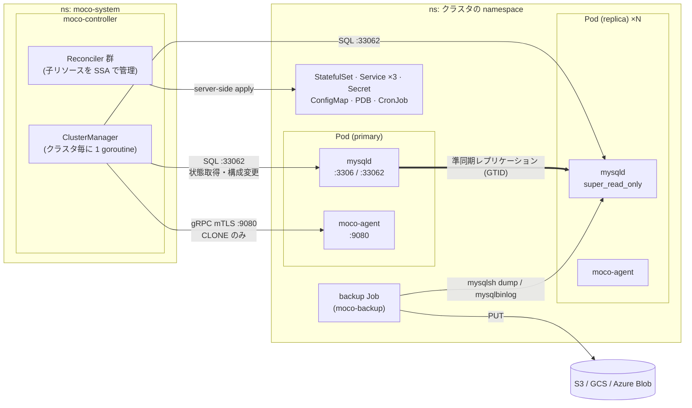

# アーキテクチャ

moco-controller は「宣言的な Reconciler」と「命令的な ClusterManager」の 2 層で構成され、後者が mysqld と直接会話してレプリケーションを維持する。

## コンポーネント一覧

| コンポーネント | 実体 | 役割 |
|---|---|---|
| moco-controller | `cmd/moco-controller` | オペレータ本体。3 Reconciler + 4 webhook + ClusterManager を 1 プロセスに同居（leader election あり） |
| moco-agent | [別リポジトリ](moco-agent.md) (sidecar) | MySQL ユーザ/プラグイン初期化、mysqld の probe、`CLONE INSTANCE` の gRPC API、slow log ローテ |
| moco-backup | `cmd/moco-backup` | CronJob/Job 内で実行される backup / restore CLI |
| kubectl-moco | `cmd/kubectl-moco` | kubectl プラグイン（[operations](operations.md) 参照） |
| slow-log | fluent-bit sidecar | slow query log の転送 |
| mysqld-exporter | sidecar（任意） | `spec.collectors` 非空のとき追加。:9104 |

> **Note** `--agent-image` の既定値は**ビルド時に埋め込まれた go.mod の moco-agent バージョン**から解決される（`cmd/moco-controller/cmd/root.go`）。MOCO と moco-agent はバージョンが密結合。

## controller と agent の役割分担

| 処理 | 担当 |
|---|---|
| ユーザ 8 種・プラグインの初期化、root 削除、RESET MASTER | moco-agent（起動時、自律的に実行） |
| レプリケーション設定・super_read_only 切替・failover 判断・接続 KILL | moco-controller（`moco-admin` で mysqld に直接 SQL） |
| CLONE INSTANCE の実行 | moco-agent（controller から gRPC で依頼される**唯一**の操作） |
| readiness / liveness の判定 | moco-agent（mysqld コンテナの probe として設定される） |

## 通信経路と認証

| 経路 | プロトコル | 備考 |
|---|---|---|
| ClusterManager → mysqld | MySQL protocol :33062 (admin) | TLS なし。`caching_sha2_password` でパスワードは暗号化（`docs/security.md`） |
| ClusterManager → moco-agent | gRPC :9080 | **mTLS**。cert-manager 発行の証明書を controller が各 ns にコピー。agent は CN=`moco-controller` を検証 |
| kubelet → moco-agent | HTTP :9081 | mysqld コンテナの `/healthz` / `/readyz` |
| アプリ → mysqld | :3306 / :33060 (X) | `moco-<name>-primary` / `-replica` Service 経由（`moco.cybozu.com/role` ラベル） |
| Prometheus → 各所 | HTTP | controller :8080、agent :8080、mysqld-exporter :9104 |

## ポートと MySQL ユーザ

ポート定数（`pkg/constants/ports.go`）: mysql 3306 / mysqlx 33060 / mysql-admin 33062 / health 9081 / agent 9080 / agent-metrics 8080 / mysqld-exporter 9104。

MySQL ユーザはシステム用 6 種（`moco-admin`, `moco-agent`, `moco-repl`, `moco-clone-donor`, `moco-exporter`, `moco-backup`）+ エンドユーザ用 2 種（`moco-readonly`, `moco-writable`）。権限の詳細は [moco-agent](moco-agent.md)。パスワードの原本は moco-system 側 Secret `mysql-<ns>.<name>` にあり、クラスタ namespace の `moco-<name>` にコピーされる。

## 関連

- [clustering-states](clustering-states.md) — ClusterManager の維持ループ
- [reconcile](reconcile.md) — Reconciler の詳細
- [pod-anatomy](pod-anatomy.md) — Pod の中身
- [security](security.md) — mTLS・パスワード・RBAC の横断ガイド
