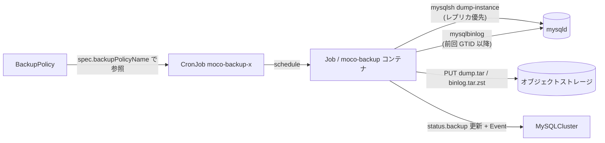

# バックアップとリストア

フルダンプは MySQL Shell の dump-instance utility、増分は mysqlbinlog によるバイナリログ保存。この 2 つの組み合わせで Point-in-Time Recovery を実現する。

## 仕組み

| 項目 | 内容 |
|---|---|
| フルダンプ | `mysqlsh util dump-instance`。`LOCK INSTANCE FOR BACKUP` により DDL のみブロック（DML は止まらない）、mysqldump より大幅に高速。zstd 圧縮 → tar でバケットへ（`pkg/bkop/backup.go#DumpFull`） |
| 増分 (binlog) | `mysqlbinlog --read-from-remote-master=BINLOG-DUMP-GTIDS --exclude-gtids=<前回の GTID>`。tar + zstd。**2 回目以降のバックアップでのみ**取得（`pkg/bkop/backup.go#DumpBinlog`） |
| ソース Pod | 初回はレプリカ優先（なければ primary）。2 回目以降は `server_uuid` が前回から変わっていない Pod のみ増分対象。全 Pod の uuid が変わっていたら binlog をスキップして full のみ + warning（`backup/backup.go#ChoosePod`） |
| 保存先 | S3 / GCS / Azure Blob（`backendType`）。MinIO 等の S3 互換も可。1 バケットを複数クラスタで共有できる |
| キー形式 | `moco/<ns>/<name>/YYYYMMDD-hhmmss/dump.tar` と `binlog.tar.zst`。binlog のキー日時は**前回バックアップ時刻**（`backup/key.go`） |
| 実行ユーザ | backup は `moco-backup`、restore は `moco-admin`。パスワードは `MYSQL_PASSWORD` 環境変数で注入 |

## バックアップの流れ

失敗条件は明確: クラスタが offline なら失敗、Pod 数が `spec.replicas` と一致しなければ "too few Pods" で失敗。binlog 取得のみ失敗した場合は full が成功していれば継続し、warning と Event（`BackupNoBinlog`）が記録される（`backup/backup.go#Backup`）。

結果は `status.backup` に記録: `time` / `elapsed` / `sourceIndex` / `sourceUUID` / `gtidSet` / `dumpSize` / `binlogSize` / `workDirUsage` / `warnings`。

## CronJob の生成

`spec.backupPolicyName` を設定すると controller が CronJob / Role / RoleBinding（`moco-backup-<name>`）を生成する。[BackupPolicy](crd-backuppolicy.md) の schedule 等は CronJob spec へ透過的にコピーされ、Job には既定で hostname 分散の podAntiAffinity が付く。`backupPolicyName` を外すと削除される（`controllers/mysqlcluster_controller.go#reconcileV1BackupJob`）。

## リストア (PITR)

`spec.restore` を付けた MySQLCluster を新規作成すると、controller が Job `moco-restore-<name>`（`backoffLimit: 0`）を 1 回だけ作る。

1. `restorePoint`（RFC3339、内部では UTC）以前で最も新しい `dump.tar` と、同ディレクトリの `binlog.tar.zst` を選択（`backup/restore.go#FindNearestDump`）
2. `mysqlsh util load-dump`（`--skipBinlog --deferTableIndexes=all --updateGtidSet=replace`）でロード
3. restorePoint がダンプ時刻より後なら `mysqlbinlog --stop-datetime` で binlog を適用
4. `status.restoredTime` を記録 → 以後 controller が通常のクラスタ構成を行う

`schema` / `users` フィールドで特定スキーマ・特定ユーザのみの部分リストアも可能（`--includeSchemas` / `--includeUsers`）。ただし対象スキーマ外のテーブルに権限を持つユーザがいるとリストアが失敗する等の注意が型コメントに明記されている（`api/v1beta2/mysqlcluster_types.go#RestoreSpec`）。

> **Warning** restore Job が失敗してもクラスタは read-only のまま放置される。**失敗した Job を削除すると再作成される**。`spec.restore` は編集不可なので、やり直すにはクラスタごと作り直す。

## 運用上の注意

- **古いバックアップは自動削除されない** — バケットのライフサイクルポリシーで消す
- **`binlog_expire_logs_seconds` をバックアップ間隔より長くする** — 短いと増分が欠けて PITR できなくなる。設定はユーザ責任
- `workVolume` は十分な容量を。実使用量は `status.backup.workDirUsage` / `moco_backup_workdir_usage_bytes` で確認できる
- 緊急バックアップは `kubectl create job --from=cronjob/moco-backup-<name> emergency-backup`
- CronJob の `concurrencyPolicy` は既定 Allow のため Job が重複しうる。status を更新できるのは 1 つだけ

## 関連

- [crd-backuppolicy](crd-backuppolicy.md) — JobConfig / BucketConfig の仕様
- [operations](operations.md) — Lost からの復旧手順
