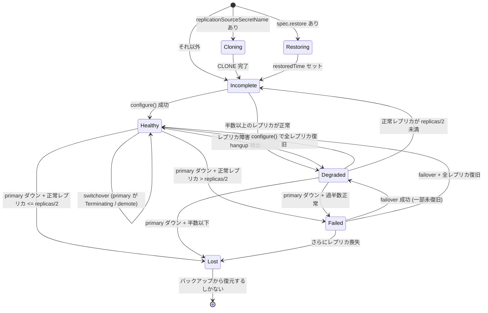

# クラスタ状態と判定ロジック

MOCO は状態機械を「保存」しない。ClusterManager が毎サイクル全インスタンスの状態を集めて状態を**再計算**し、状態に応じた操作を実行する level-triggered な設計。

## 維持ループ

ClusterManager は MySQLCluster ごとに goroutine（`managerProcess`）を 1 本起動し、`--check-interval`（既定 1 分）ごと、またはイベント（Pod 変化、reconcile 完了）を契機に 1 サイクルを回す。操作を行った場合は `redo` として即座に次サイクルが走る（`clustering/manager.go`, `process.go#Start`）。

```
do():  GatherStatus       全 mysqld から並列に状態収集（失敗は 3 秒間隔で最大 3 回試行）
       DecideState        クラスタ状態を判定
       updateStatus       status / conditions / メトリクス更新
       PreventPodDeletion レプリカ遅延超過なら primary に prevent-delete アノテーション
       操作               状態に応じて switchover / failover / configure / clone
```

収集内容: 各 mysqld の admin ポート (33062) からグローバル変数（`server_uuid`, `gtid_executed`, `gtid_purged`, `read_only`, `super_read_only`, semi-sync 変数）、`SHOW REPLICAS` / `SHOW REPLICA STATUS`、`performance_schema.clone_status`、`Rpl_semi_sync_master_wait_sessions`。primary は 100ms 待って再取得し、その `gtid_executed` を基準値にする（`clustering/status.go#GatherStatus`）。

## 8 つのクラスタ状態

| 状態 | 意味 | 実行される操作 |
|---|---|---|
| **Healthy** | 全 Pod Ready、全レプリカが errant なし・super_read_only・primary に接続済み、`SHOW REPLICAS` のクラスタ内レプリカ数が replicas−1 に完全一致 | 必要なら switchover |
| **Cloning** | 外部 MySQL からの初回 CLONE 中（intermediate primary） | clone 実行 / 完了待ち |
| **Restoring** | バックアップからのリストア中 | 何もしない |
| **Degraded** | primary は書き込み可能だが一部レプリカに問題（半数以上は正常） | switchover または configure |
| **Failed** | primary 死亡 or データ喪失 + 正常レプリカが**過半数** | **failover** |
| **Lost** | primary 死亡 + 正常レプリカが半数以下。**自動復旧不能** | 何もできない（リストアが必要） |
| **Incomplete** | 上記以外（初期構築中など） | configure |
| **Offline** | `spec.offline: true`。判定は**最優先** | 何もしない |

判定順（`clustering/status.go#DecideState`）: Offline → Cloning → Restoring → Healthy → Degraded → Failed → Lost → Incomplete。

> **Note** `Offline` 状態は `docs/clustering.md` には未記載（コードのみ）。→ [docs-discrepancies](docs-discrepancies.md)

## 状態遷移



`replicas/2` は整数除算（replicas=3 → 1, replicas=5 → 2）。primary 死亡時は必ず Failed か Lost のどちらかになる（`isFailed` と `isLost` は同じ前提・同じカウントで閾値の向きだけが違う）。

## 判定関数の要点

- `isHealthy`: 全 Pod Ready + 全レプリカ正常 + `replicasInCluster == replicas-1`（完全一致）+ primary の read_only 条件。OK なレプリカは switchover 候補 `Candidates` に積まれ、**最小 ordinal** が候補になる
- `isDegraded`: primary Pod Ready + データ喪失なし + `okReplicas >= replicas/2 && okReplicas != replicas-1`（後者が Healthy との排他条件）
- `lostData`: primary の GTID が空なのにレプリカが GTID を持っている = primary がデータを失った
- `needSwitch`: primary Pod に `deletionTimestamp` があるか `moco.cybozu.com/demote: true` アノテーション

## 副作用フラグ

- **PreventPodDeletion**: `spec.maxDelaySecondsForPodDeletion > 0` のとき、レプリカの `Seconds_Behind_Source` が閾値超過なら primary Pod に `moco.cybozu.com/prevent-delete: true` を付与。**この間は switchover も保留**（`process.go`）
- **hangup replica 検出**: レプリカ側で `Rpl_semi_sync_master_wait_sessions > 0`（レプリカが ACK 待ちしている異常）ならそのレプリカを死亡扱いに → Healthy から Degraded に落ちる

## conditions とメトリクスへの反映

| 状態 | Initialized | Available | Healthy |
|---|---|---|---|
| Cloning / Restoring | False | False | False |
| Healthy | True | **True** | **True** |
| Degraded | True | **True** | False |
| Failed / Lost / Incomplete / Offline | True | False | False |

clustering 停止時（Pause）は Available / Healthy が Unknown になり、メトリクスには NaN がセットされる。

## 落とし穴

- **Pod が 1 つでも欠けると GatherStatus がエラーで打ち切られ、判定も操作も行われない**（offline 時を除く）
- `spec.offline` は最優先判定 — Failed 状態でも offline にすれば failover は走らない
- mysqld への接続は connTimeout 5s / readTimeout 1m。落ちたインスタンスがあると 1 サイクルに 3 秒 × 3 回のリトライ分の待ちが入る

## 関連

- [clustering-operations](clustering-operations.md) — 各状態で実行される操作の実装
- [moco-agent](moco-agent.md) — Pod Ready の実体（readiness probe）
