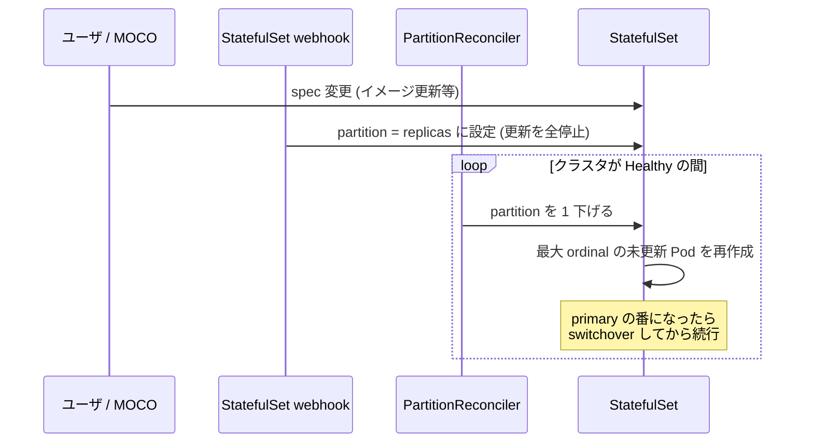

# 安全なローリングアップデート（partition 制御）

StatefulSet の更新を「partition を 1 つずつ下げる」操作に変換し、クラスタが Healthy なときだけ進める仕組み。MySQL バージョンアップの安全性の要。

## 仕組み

MySQLCluster 所有の StatefulSet に対して mutating webhook（`/mutate-apps-v1-statefulset`、`api/v1beta2/statefulset_webhhok.go` — ファイル名の typo は原文ママ）が介入する:

1. spec 変更時、`rollingUpdate.partition = replicas` にセット（= 全 Pod の更新を止めた状態から開始）
2. `StatefulSetPartitionReconciler` が「クラスタが Healthy かつ Pod が rollout-ready」のときだけ partition を 1 つずつ下げる（rate limiter は `--partition-update-interval`）
3. partition **だけ**の変更はそのまま通す。他の spec 変更が同時に入ると partition をリセットして最初からやり直し
4. 更新は ordinal の大きい Pod（= replica）から進み、primary Pod の番になると Terminating を検知した ClusterManager が [switchover](clustering-operations.md) してから更新が進む

`moco.cybozu.com/force-rolling-update: "true"` アノテーションでこの機構をバイパスし、通常のローリングアップデートに戻せる。

## MySQL バージョンアップとの関係

`docs/upgrading.md` の前提:

- **ダウングレード不可**: MySQL 8.0 以降はデータディクショナリのバージョンが上がるとダウングレードできない
- **replica は source と同じか新しいバージョン**でなければならない

MOCO はこれを 3 つの実装で満たす:

1. `updateStrategy: RollingUpdate`（ordinal の大きい方 = replica 側から更新）
2. switchover 先を**最小 ordinal（= 未更新側）**にする → 新 primary は常に古いバージョン側になり「replica ≧ source」が保たれる
3. startupProbe を長く待つ（既定 `startupWaitSeconds: 3600` → 最大 1 時間）— アップグレード時のデータ更新に時間がかかるため

手順はシンプル: ① Healthy を確認 → ② リリースノートで非互換確認（バックアップ推奨） → ③ `podTemplate` の mysqld イメージを書き換え。

> **Warning** アップグレード中にインスタンスが落ちると、更新済みインスタンスが primary に選ばれることがある。その場合は旧バージョンの replica を再初期化する必要がある（`docs/upgrading.md` Limitations）。

## 関連

- [reconcile](reconcile.md) — StatefulSet を生成する側
- [clustering-operations](clustering-operations.md) — switchover の実装
- [operations](operations.md) — 運用手順
